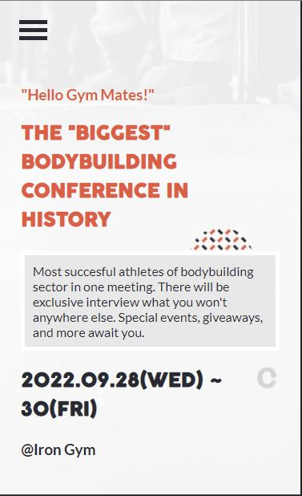

# Capstone Project

> This project is the capstone project of module 1.
> This project's topic is personalized and it is about bodybuilding conference.
> The project's design followed Cindy Shin's [template](https://www.behance.net/gallery/29845175/CC-Global-Summit-2015)

## Built With

- HTML5
- CSS3
- JavaScript

## Live Demo (if available)

> Project [Live Demo Link](https://fsher07.github.io/Html-Css-JavaScript-CapstoneProject/)
> Video recording [Live Demo Link](https://www.loom.com/share/865567aa244145afbc24b5f67de12032)

## Getting Started

To get a local copy up and running follow these simple example steps.

-to run the project locally, clone the project using the commands and link below:

-git clone https://github.com/Fsher07/Fsher07.github.io.git
-cd Fsher07.github.io

👤 **Author1**

- GitHub: [Salim](https://github.com/Fsher07)
- Twitter: [Salim](https://twitter.com/furkansalimhdr1)
- LinkedIn: [Salim](https://www.linkedin.com/in/furkan-salim-h%C4%B1d%C4%B1r-3441ab1b2/)

## 🤝 Contributing

Contributions, issues, and feature requests are welcome!

Feel free to check the [issues page](https://github.com/Fsher07/Html-Css-JavaScript-CapstoneProject/issues).

## Show your support

Give a ⭐️ if you like this project!

## Acknowledgments

- Cindy Shin whose design template was used to create this project.

## 📝 License

This project is public.
